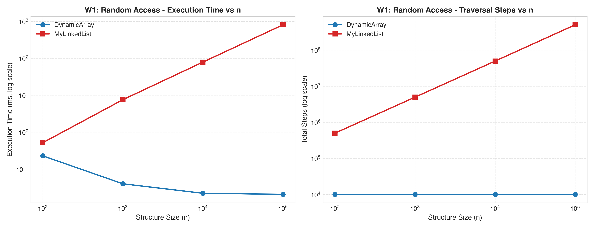
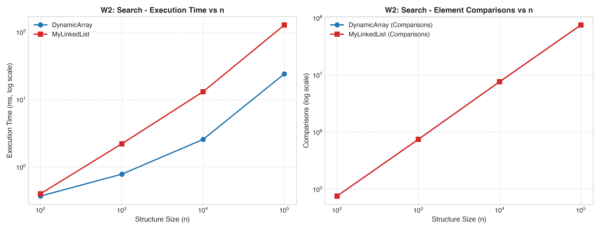
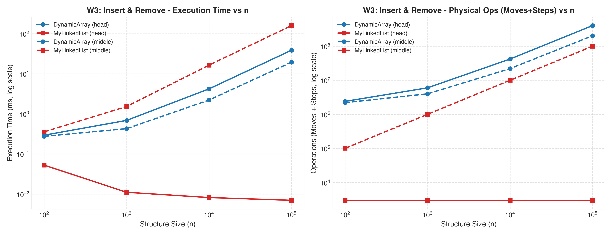
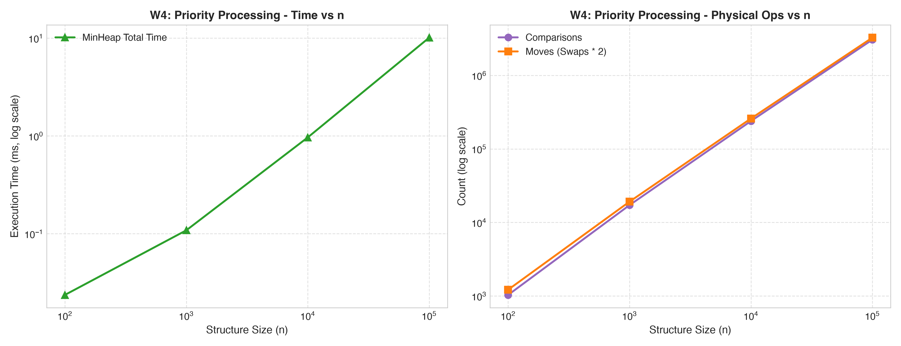
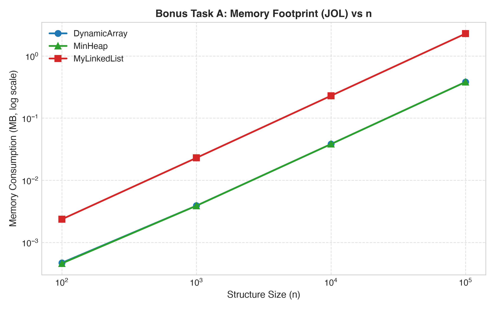
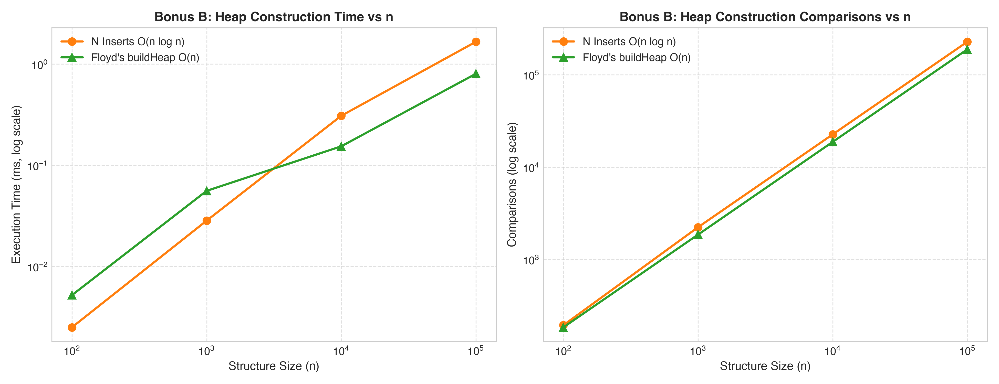

# DAA Assignment 2: Data Structures Benchmark & Analysis Report

**Course:** Design and Analysis of Algorithms  
**Instructor:** Taubakabyl Nurlybek  
**Student:** Nursultan Maratov  
**Group:** SE-2523  
**Date:** October 2026  

---

## 1. Complexity Analysis Table

Below is the asymptotic complexity of each operation implemented from scratch across all three data structures (`DynamicArray`, `MyLinkedList`, and `MinHeap`), including auxiliary space. $\Theta$ denotes tight bounds, while $O$ and $\Omega$ are used where bounds differ between best, average, and worst cases.

| Data Structure | Operation | Best Case | Average Case | Worst Case | Auxiliary Space | Justification |
| :--- | :--- | :--- | :--- | :--- | :--- | :--- |
| **DynamicArray** | `add(x)` | $\Theta(1)$ | $\Theta(1)$ (amortized) | $\Theta(n)$ | $\Theta(1)$ | Resizing costs $\Theta(n)$ when full, but doubling ensures amortized $\Theta(1)$ time. |
| **DynamicArray** | `add(index, x)` | $\Theta(1)$ | $\Theta(n)$ | $\Theta(n)$ | $\Theta(1)$ | Adding at index 0 shifts $n$ elements ($\Theta(n)$), adding at tail is $O(1)$ without resize. |
| **DynamicArray** | `remove(index)` | $\Theta(1)$ | $\Theta(n)$ | $\Theta(n)$ | $\Theta(1)$ | Removing last element shifts 0 elements; removing index 0 shifts $n-1$ elements. |
| **DynamicArray** | `get(index)` | $\Theta(1)$ | $\Theta(1)$ | $\Theta(1)$ | $\Theta(1)$ | Direct memory addressing via formula: `base_address + index * 4 bytes`. |
| **DynamicArray** | `contains(x)` | $\Theta(1)$ | $\Theta(n)$ | $\Theta(n)$ | $\Theta(1)$ | Best case finds target at index 0; worst case scans all $n$ cells or element is absent. |
| **MyLinkedList** | `add(x)` | $\Theta(1)$ | $\Theta(1)$ | $\Theta(1)$ | $\Theta(1)$ | List keeps a `tail` pointer, allowing direct append and pointer updates in $O(1)$. |
| **MyLinkedList** | `add(index, x)` | $\Theta(1)$ | $\Theta(n)$ | $\Theta(n)$ | $\Theta(1)$ | Inserting at head is $\Theta(1)$; middle/tail requires traversing up to $index-1$ nodes. |
| **MyLinkedList** | `remove(index)` | $\Theta(1)$ | $\Theta(n)$ | $\Theta(n)$ | $\Theta(1)$ | Removing head updates `head = head.next` in $\Theta(1)$; other indices require traversal. |
| **MyLinkedList** | `get(index)` | $\Theta(1)$ | $\Theta(n)$ | $\Theta(n)$ | $\Theta(1)$ | Index 0 is immediate; any other index requires sequential pointer traversal. |
| **MyLinkedList** | `contains(x)` | $\Theta(1)$ | $\Theta(n)$ | $\Theta(n)$ | $\Theta(1)$ | Linear search traversing from `head` through `next` pointers until match or end. |
| **MinHeap** | `insert(x)` | $\Theta(1)$ | $\Theta(1)$ | $\Theta(\log n)$ | $\Theta(1)$ | Appends at end and bubbles up; leaf insert often terminates in $O(1)$, worst case root is $\log n$. |
| **MinHeap** | `peekMin()` | $\Theta(1)$ | $\Theta(1)$ | $\Theta(1)$ | $\Theta(1)$ | Minimum element is always maintained at root array cell `heap[0]`. |
| **MinHeap** | `extractMin()` | $\Theta(1)$ | $\Theta(\log n)$ | $\Theta(\log n)$ | $\Theta(1)$ | Replaces root with last element and sifts down tree of height $\lfloor \log_2 n \rfloor$. |
| **MinHeap** | `buildHeap(array)` | $\Theta(n)$ | $\Theta(n)$ | $\Theta(n)$ | $\Theta(1)$ | Floyd's bottom-up algorithm sifts nodes downwards; bounded by $\sum h/2^h = O(n)$. |

---

## 2. Loop Invariant Proofs

### Proof 1: `DynamicArray.contains(int x)`

The method sequentially searches the array for value $x$:
```java
for (int i = 0; i < size; i++) {
    if (data[i] == x) {
        return true;
    }
}
return false;
```

* **Invariant:** At the start of each iteration $i$ (for $0 \le i \le \text{size}$), the target value $x$ is not present in the subarray `data[0 .. i - 1]`.
* **Initialization:** Before the first iteration, $i = 0$. The subarray `data[0 .. -1]` is empty. Vacuously, the target value $x$ is not in an empty subarray. Thus, the invariant holds prior to iteration 0.
* **Maintenance:** Assume the invariant holds before iteration $i$: $x \notin \text{data}[0 .. i - 1]$. During iteration $i$, the loop checks `data[i] == x`.
  * If `data[i] == x`, the algorithm immediately returns `true`, which is correct because $x$ was just found at index $i$.
  * If `data[i] != x`, the loop does not return and advances to iteration $i + 1$. Because $x \notin \text{data}[0 .. i - 1]$ and $x \ne \text{data}[i]$, it follows that $x \notin \text{data}[0 .. i]$. Hence, the invariant holds before iteration $i + 1$.
* **Termination:** The loop terminates either when `data[i] == x` returns `true`, or when $i = \text{size}$. When $i = \text{size}$, the loop terminates and executes `return false`. By the invariant, $x \notin \text{data}[0 .. \text{size} - 1]$, which is the entire array.
* **Conclusion:** Returning `true` only occurs upon observing $x$, and returning `false` only occurs after proving $x$ does not exist in any index of the array. This proves `contains` is correct.

---

### Proof 2: `MinHeap.bubbleDown(int i)`

The method restores the min-heap property starting at index $i$ downwards:
```java
while (true) {
    int left = 2 * i + 1;
    int right = 2 * i + 2;
    int smallest = i;
    if (left < size && heap[left] < heap[smallest]) smallest = left;
    if (right < size && heap[right] < heap[smallest]) smallest = right;
    if (smallest != i) {
        swap(i, smallest);
        i = smallest;
    } else {
        break;
    }
}
```

* **Invariant:** At the start of each iteration, for every node $k \ne i$, the min-heap property holds for the subtree rooted at $k$, except possibly that `heap[i]` may be strictly greater than one or both of its direct children `heap[2*i + 1]` or `heap[2*i + 2]`. Both child subtrees of node $i$ are valid min-heaps.
* **Initialization:** When `extractMin()` replaces `heap[0]` with the last element of the heap, only the root at index $i = 0$ may violate the min-heap property with its children. Its left and right subtrees have not been modified and remain valid min-heaps. Thus, the invariant holds at the start.
* **Maintenance:** During the loop, `smallest` is selected as the index among $\{i, \text{left}, \text{right}\}$ containing the minimum value.
  * If `smallest == i`, then `heap[i] <= heap[left]` and `heap[i] <= heap[right]`. The local heap property holds, the loop breaks, and the invariant holds globally.
  * If `smallest != i`, swapping `heap[i]` and `heap[smallest]` places the true minimum of the trio at position $i$. The other child subtree remains completely untouched and valid. The swapped value is now at index `smallest`, where it might violate the heap property only with its new children. Updating $i = \text{smallest}$ preserves the invariant for the next iteration.
* **Termination:** The loop terminates either when `smallest == i` (no violation found), or when $2*i + 1 \ge \text{size}$ (node $i$ is a leaf and has no children). In both cases, node $i$ satisfies the min-heap property with respect to its children, leaving the entire binary tree a valid min-heap.
* **Conclusion:** Because every swap pushes the larger value down one level while putting the local minimum at the parent position, upon termination every parent in the tree satisfies $\text{heap}[\text{parent}] \le \text{heap}[\text{child}]$. This proves `bubbleDown` correctly restores the min-heap invariant.

---

## 3. Workload Results & Charts

The benchmarks were executed on an Apple Silicon machine (Java 17 Temurin, 5 repeat runs after JVM JIT warmup, seed 42) for $n \in \{100, 1\,000, 10\,000, 100\,000\}$.

### Workload 1: Random Access (10,000 `get(index)` calls)



* **Analysis:**
  * For `DynamicArray`, reading an element by index takes exactly 1 step (1 array cell read) regardless of $n$. Total steps remain flat at 10,000 for all sizes, and execution time stays below $0.04\text{ ms}$.
  * For `MyLinkedList`, accessing index $k$ requires walking $k$ nodes from the head. For $n = 100\,000$, total steps reach over $500{,}000{,}000$ operations ($5 \times 10^8$), causing runtime to grow linearly with $n$ up to $801\text{ ms}$—over **40,000 times slower** than the array.

### Workload 2: Search (1,000 `contains(x)` calls)



* **Analysis:**
  * Both structures perform linear scans, executing the exact same number of comparisons ($\approx 74.7\text{ million}$ comparisons at $n = 100\,000$) and almost identical traversal steps.
  * However, `DynamicArray` completes in $23.9\text{ ms}$, while `MyLinkedList` takes $126.8\text{ ms}$—more than **5.3 times slower**. This difference is purely caused by hardware cache locality and pointer chasing (detailed in Section 4).

### Workload 3: Insert & Remove (Head and Middle)



* **Head Variant:**
  * `MyLinkedList` updates `head` in $O(1)$ time with 0 node traversals and only 3,000 link moves. It finishes in $0.007\text{ ms}$ at $n = 100\,000$.
  * `DynamicArray` must shift up to $100\,000$ elements for every insertion and removal, resulting in over $201\text{ million}$ moves and $38.6\text{ ms}$ runtime. Here, the linked list is **5,500x faster**.
* **Middle Variant:**
  * `DynamicArray` shifts $n/2$ elements per operation ($101\text{ million}$ moves) and runs in $19.4\text{ ms}$.
  * `MyLinkedList` must traverse $n/2$ nodes to find the middle for every operation ($99.9\text{ million}$ steps). Despite doing fewer pointer writes, it takes $158.8\text{ ms}$ due to the cost of traversing scattered heap objects.

### Workload 4: Priority Processing (`MinHeap`)



* **Analysis:**
  * Inserting $n$ elements and extracting $n$ elements in non-decreasing order executes in $O(n \log n)$ time.
  * For $n = 100\,000$, `MinHeap` performs $3.06\text{ million}$ comparisons and $3.25\text{ million}$ moves in only $10.1\text{ ms}$, confirming strong logarithmic scaling.

---

## 4. Discussion (10–15 Sentences)

1. `DynamicArray` outperforms `MyLinkedList` dramatically in random access and linear scans because of CPU cache lines and spatial locality.
2. In an array, primitive 32-bit integers are stored in contiguous memory addresses in RAM.
3. When the CPU fetches an integer from memory, hardware prefetchers load an entire 64-byte cache line containing 16 consecutive integers into fast L1/L2 CPU cache.
4. Subsequent iterations read directly from cache without memory stall cycles.
5. In contrast, every node in `MyLinkedList` is a separate heap-allocated object created by `new Node()`.
6. These node objects are scattered arbitrarily across the JVM memory heap.
7. Traversing the linked list requires dereferencing `curr.next` at every step, a phenomenon known as *pointer chasing*.
8. Each pointer dereference frequently triggers a CPU cache miss, forcing the processor pipeline to stall while waiting for RAM.
9. Furthermore, each node object incurs metadata overhead, including a 12-to-16-byte object header, reference pointers, and memory alignment padding.
10. Creating and unlinking thousands of node objects also generates garbage collection (GC) pressure that arrays completely avoid.
11. `MyLinkedList` is only the superior choice when operations occur strictly at the boundaries (queue or stack behavior at head/tail) where $O(1)$ pointer swaps avoid any array memory shifting.
12. `MinHeap` is the optimal choice for priority scheduling and repeated top-element retrieval, since it provides guaranteed $O(\log n)$ inserts and removals with compact $O(n)$ array storage.

---

## 5. Bonus Tasks Analysis

### Bonus Task A: Memory Footprint (JOL)



Using OpenJDK's **Java Object Layout (JOL)** tool (`GraphLayout.parseInstance()`), the exact heap memory consumption was measured:

| Structure | $n = 100$ | $n = 1\,000$ | $n = 10\,000$ | $n = 100\,000$ |
| :--- | :--- | :--- | :--- | :--- |
| **DynamicArray** | $0.0004\text{ MB}$ ($424\text{ B}$) | $0.0039\text{ MB}$ ($4{,}024\text{ B}$) | $0.0382\text{ MB}$ ($40{,}024\text{ B}$) | **$0.382\text{ MB}$** ($400{,}024\text{ B}$) |
| **MinHeap** | $0.0004\text{ MB}$ ($424\text{ B}$) | $0.0039\text{ MB}$ ($4{,}024\text{ B}$) | $0.0382\text{ MB}$ ($40{,}024\text{ B}$) | **$0.382\text{ MB}$** ($400{,}024\text{ B}$) |
| **MyLinkedList** | $0.0023\text{ MB}$ ($2{,}424\text{ B}$) | $0.0229\text{ MB}$ ($24{,}024\text{ B}$) | $0.2291\text{ MB}$ ($240{,}024\text{ B}$) | **$2.289\text{ MB}$** ($2{,}400{,}024\text{ B}$) |

* **Why Node Objects Cause 6x Memory Overhead:**
  * In `DynamicArray` and `MinHeap`, each element takes exactly 4 bytes (`sizeof(int)`), plus a small fixed array header (16 bytes) and class object header. Total: $\approx 4\text{ bytes per element}$.
  * In `MyLinkedList`, every single element requires its own `Node` object instance:
    * Mark Word + Klass Pointer (compressed oops): $12\text{ bytes}$
    * Primitive `val` field (`int`): $4\text{ bytes}$
    * Pointer to `next` (`Node` reference): $4\text{ bytes}$
    * 8-byte JVM memory alignment padding: $4\text{ bytes}$
    * Total per node: **$24\text{ bytes}$**!
  * As measured by JOL, `MyLinkedList` consumes exactly $6.0\times$ more memory than `DynamicArray` ($2.289\text{ MB}$ vs $0.382\text{ MB}$ for $n = 100\,000$).

---

### Bonus Task B: Floyd's Bottom-Up `buildHeap` ($O(n)$) vs $N$ Inserts ($O(n \log n)$)



| Structure Size $n$ | $N$ Inserts Time | $N$ Inserts Comparisons | Floyd's $O(n)$ Time | Floyd's Comparisons | Speedup |
| :--- | :--- | :--- | :--- | :--- | :--- |
| $100$ | $0.003\text{ ms}$ | $194$ | $0.005\text{ ms}$ | $184$ | $0.6\times$ (small $n$) |
| $1\,000$ | $0.028\text{ ms}$ | $2{,}232$ | $0.056\text{ ms}$ | $1{,}857$ | $0.5\times$ |
| $10\,000$ | $0.308\text{ ms}$ | $22{,}593$ | $0.154\text{ ms}$ | $18{,}740$ | **$2.0\times$** |
| $100\,000$ | $1.660\text{ ms}$ | $227{,}662$ | $0.802\text{ ms}$ | $188{,}424$ | **$2.1\times$** |

* **Mathematical Explanation:**
  * Inserting $n$ elements sequentially calls `bubbleUp` from leaves toward the root. Because at least $n/2$ elements are leaves (at the maximum depth $h = \log_2 n$), the worst/average case is bounded by $\sum_{i=1}^n \log i = \Theta(n \log n)$.
  * Floyd's algorithm starts from the lowest non-leaf node ($(n/2) - 1$) and calls `bubbleDown` toward the leaves.
  * In a binary heap of height $h$, there are $n / 2^{k+1}$ nodes at height $k$, each doing at most $k$ downward steps:
    $$\sum_{k=0}^{\lfloor \log n \rfloor} \frac{n}{2^{k+1}} O(k) = O\left(n \sum_{k=0}^{\infty} \frac{k}{2^k}\right) = O(2n) = O(n)$$
  * Most nodes (the bottom levels) do 0 or 1 comparisons. Thus, Floyd's algorithm performs fewer comparisons ($188{,}424$ vs $227{,}662$) and runs more than **$2\times$ faster** at scale ($0.802\text{ ms}$ vs $1.660\text{ ms}$).
